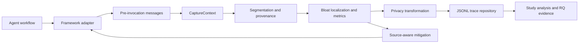

# Chapter 3: Context Bloat Model and Auditing Framework

## 3.1 Definition and Taxonomy of Context Bloat

The conceptual object of this thesis is the context visible to a language model
at one invocation of an agent workflow. Let

$$
C_i = \langle m_{i,1}, m_{i,2}, \ldots, m_{i,n_i} \rangle
$$

denote the ordered message sequence sent at invocation $i$. A message has a
role, content, optional name, and source metadata. Messages are further divided
into ordered text segments:

$$
S_i = \langle s_{i,1}, s_{i,2}, \ldots, s_{i,k_i} \rangle.
$$

The segment is the smallest unit to which the auditor assigns a source,
identity, size, and bloat label. A segment records its parent message, message
index, ordinal position, role, source type, character count, token count, raw
content hash, normalized content hash, and optional source identifier or
relevance score. This representation retains message ordering while supporting
source-level analysis.

The framework uses eight source types: `system`, `user`, `framework`,
`retrieval`, `memory`, `tool`, `generated_trace`, and `other`. System and user
content represent explicit instructions and requests. Framework content
includes orchestration instructions and tool-use formatting inserted by the
runtime. Retrieval and memory distinguish external documents from stored
interaction state. Tool content represents observations returned by a tool,
while generated traces contain intermediate assistant output such as a plan or
action selection. `other` is a fallback for content that cannot be assigned
reliably.

This thesis defines *context bloat* as model-visible content that is avoidable
under an explicit task- and invocation-specific criterion. Three properties of
the definition matter.

First, bloat is not equivalent to length. A long set of distinct evidence can
be necessary, and a short input can contain an exact duplicate. Second, bloat
is label-dependent. A segment is not classified as unnecessary merely because
it comes from a particular source. Third, bloat is assessed at the time of use.
A memory item may have been useful when created but be stale for the current
query.

The controlled taxonomy contains four evaluated labels.

**Exact duplicate.** A retrieval, memory, or tool segment is an exact duplicate
when its normalized hash matches an earlier segment from the same source. Text
normalization removes leading and trailing whitespace, collapses whitespace,
and applies case folding before SHA-256 hashing. The later occurrence is marked
as bloat; the first occurrence remains available as evidence.

**Near duplicate.** A segment is a near duplicate when the Jaccard similarity
between its case-folded lexical token set and that of an earlier segment from
the same source is at least 0.8. If $W(a)$ is the token set of segment $a$, then

$$
J(a,b) = \frac{|W(a) \cap W(b)|}{|W(a) \cup W(b)|}.
$$

Near duplication captures paraphrased or slightly modified repetition that
does not share a normalized hash.

**Low query relevance.** A retrieval or memory segment is labeled
`low_query_relevance` when an explicit relevance score is below 0.05. If no
score is available, the detector uses query-token overlap:

$$
Q(s,q) = \frac{|W(s) \cap W(q)|}{|W(q)|}.
$$

In the controlled dataset, a stale memory is represented through this label
because it is unrelated to the current query. The label does not claim to model
every semantic form of staleness.

**Verbose tool output.** A tool segment is labeled `verbose_tool_output` when
its token count is at least 80. Formal tool fixtures contain a concise result
followed by repeated diagnostic and provenance detail that is not required to
answer the task. The threshold is therefore tied to the controlled generator
and should not be used as a universal production rule.

The stress cohort combines retrieval, memory, and tool bloat in one workflow.
This is called cross-source accumulation rather than a fifth segment label,
because the underlying segments retain the same four labels. The distinction
allows the auditor to localize each contribution even when several sources
grow together.

## 3.2 Context Provenance and Measurement Model

For a segment $s$, let $t(s)$ be its token count and $\sigma(s)$ its source.
The total context size of invocation $i$ is

$$
T_i = \sum_{s \in S_i} t(s).
$$

The corresponding character total is calculated in the same way. The source
contribution ratio for source $x$ is

$$
SC_{i,x} =
\frac{\sum_{s \in S_i:\sigma(s)=x} t(s)}{T_i}.
$$

The ratios sum to one when $T_i>0$ and reveal which sources dominate an
invocation. A runtime warning is emitted when a non-system, non-user source
accounts for at least 65% of the context.

Exact redundant tokens are the tokens of every normalized-hash occurrence
after the first. If $R_i$ is that set of later segments, exact redundancy is

$$
RR_i = \frac{\sum_{s \in R_i} t(s)}{T_i}.
$$

The near-redundancy ratio $NRR_i$ is defined analogously using later segments
whose within-source Jaccard similarity reaches 0.8. The implementation also
reports duplicate and near-duplicate segment counts. `Unique Information
Ratio` is retained in the artifact as the complement $1-RR_i$, but the name
should be interpreted conservatively: it measures non-repeated tokens under
normalization, not semantic information in the information-theoretic sense.

The framework stores four evidence namespaces. $I_i$ is the set of segments
marked by an injected perturbation in Study A; $D_i$ is the set identified by
the heuristic detector; $H_i$ is the set receiving an adjudicated
human-reference `remove` decision in Study B; and $C_i$ is the subset whose
removal preserves task performance in the Study C counterfactual test. An
external-validation trace is rejected if it contains injected labels.

The injected, detected, and human-reference token ratios are respectively

$$
IBR_i = \frac{\sum_{s \in I_i}t(s)}{T_i},\qquad
DBR_i = \frac{\sum_{s \in D_i}t(s)}{T_i}.
$$

$$
HBR_i = \frac{\sum_{s \in H_i}t(s)}{T_i}.
$$

No composite measure includes both detector output and the reference used to
validate that detector. In particular, the former
$\max(RR_i,NRR_i,DBR_i)$ construction is not used for RQ2 because correlating
it with a reference generated by the same rule family would be circular.
Study B instead compares $DBR_i$ directly with $HBR_i$. Study C evaluates the
stronger property of counterfactual removability separately.

Context growth is calculated within the same run, task, condition, and
repetition. For two consecutive invocations,

$$
CGR_i = \frac{T_i - T_{i-1}}{T_{i-1}},
$$

when $T_{i-1}>0$. This is particularly relevant to tool workflows, which use a
planning invocation followed by a final invocation containing the plan and
tool observation. A growth-spike flag is emitted when the current context
exceeds 150% of the previous context.

Source-specific bloat is reported in two forms. For Study A, the numerator is
injected bloat tokens. For Study B, it is tokens in adjudicated `remove`
segments. The aggregate ratio divides labeled tokens of a source by all tokens
of that source. The mean ratio is first computed per trace and then averaged
within real task IDs. Task-cluster bootstrap intervals and pairwise Hedges'
$g$ values accompany the natural-trace estimates. Controlled and natural
rankings are never pooled.

Detection is evaluated both as binary segment identification and as subtype
classification. Binary precision, recall, and F1 compare the set of detected
segment locations with the human-reference `remove` locations. Subtype
metrics compare `(trace, segment, reason)` tuples. Localization accuracy is the
proportion of human-reference locations also identified by the detector,
regardless of whether its subtype name matches. Task-macro estimates average
within the 60 independent task IDs before uncertainty is calculated.

## 3.3 Runtime Auditing Framework

The artifact is organized around a domain/application/ports/adapters
architecture. Figure 3.1 presents the runtime data flow.

*Figure 3.1. Runtime capture, analysis, and mitigation flow.*

The domain layer defines immutable models such as `Message`, `TextSegment`,
`AuditTrace`, `ProviderUsage`, `MitigationDecision`, and `RunManifest`.
It has no file-system, provider, or framework dependency. The application layer
implements capture, localization, mitigation, evaluation, reporting, study
bundling, and annotation export. Ports define the contracts for a chat
provider, tokenizer, trace repository, dataset repository, clock, and
identifier generator. Adapters implement those contracts for LangChain,
DeepSeek, mock execution, JSONL storage, versioned datasets, and run
directories.

The principal instrumentation point is the provider transport immediately
before an HTTP invocation. A `ModelRequestEnvelope` contains messages,
separately supplied system instructions, tool definitions, generation
parameters, and a response format. For LangChain, the runtime executes an
actual `BaseChatModel.invoke()` path, binds tool schemas, and records the
framework message batch. Custom ReAct reaches the same provider port directly.
The provider adapter serializes the final OpenAI-compatible body, computes its
canonical SHA-256, and stores a redacted `ProviderRequestRecord`. A separate
framework-capture hash is compared with that hash; disagreement creates a
`payload_mismatch` flag.

The instrumentation therefore supports a precise but bounded claim: it records
the complete request serialized by the client. It cannot observe undocumented
rewriting, tokenization, or routing performed after the provider receives the
request. This boundary is reported rather than hidden behind the broader term
"the exact prompt seen by the model."

Source labeling first uses explicit message metadata. If metadata is absent,
the fallback labeler examines roles and conservative text markers for
retrieval, memory, framework instructions, and generated traces. A retrieved
document or memory session carrying a source identifier remains an atomic
segment; line-level splitting would make independent annotation infeasible and
would break the provenance unit. Tool definitions are represented as
`tool_schema` segments, whereas returned observations remain `tool` segments.
Additional system instructions and response formats are also included in the
measurement model.

Each capture request includes task, framework, provider, model, configuration,
workflow, dataset version, split, analysis cohort, repetition, seed, invocation
index, generation parameters, and configuration hash. The resulting trace adds
a unique trace identifier, timestamp, request envelope, provider request
record, segments, metrics, risk flags, evidence-tier labels, usage, latency,
task output, score, and mitigation decisions. Schema 1.2.1 is the current
writer. Schemas 1.1.0 and 1.2.0 remain read-only for archived evidence.

Traces are appended to `traces/invocations.jsonl`. Derived invocation and task
tables are written as CSV, while summaries and RQ evidence use JSON. Every
experiment receives a unique directory. A collision is an error rather than an
overwrite. The run manifest begins in `running` state and ends as `completed`
or `failed`. It records the project and schema versions, Git commit, dependency
versions, model call date, configuration and dataset hashes, seed, token usage,
output file list, SHA-256 hashes, and a redacted failure reason. Real-provider
runs require a clean Git worktree so that the recorded commit identifies the
executed code.

Text persistence is governed by `full`, `redacted`, and `hash-only` privacy
modes. Redaction removes bearer credentials, common secret assignments, email
addresses, and phone-like strings before persistence. Hash-only mode replaces
text with its SHA-256 identity. Character counts, token counts, and hashes are
computed from the original in-memory text before the stored representation is
applied. The formal study uses redacted mode. This policy does not provide
complete data-loss prevention, but it separates measurement from the decision
to retain raw text.

## 3.4 Detection, Localization, and Mitigation

Detection processes segments in message order and maintains prior segments by
source. Exact matching is checked first, followed by near duplication. A
retrieval or memory segment is then evaluated for query relevance, and a tool
segment for verbosity. More than one label may be attached to a segment. Each
finding records the segment identifier, source, label, score, and, for
duplication, the earlier evidence segment. Localization is therefore part of
the detector output rather than a separate post-hoc explanation.

The auditing guard also emits three operational signals. `duplicate_segments`
indicates at least one repeated normalized hash. `context_growth_spike`
indicates more than 50% growth from the preceding invocation in the same
sequence. `source_dominance:<source>` indicates that a managed source reaches
65% of context tokens. These signals are descriptive warnings and are not used
as independent RQ1 reference labels.

The Study A `source-aware` mitigation manages retrieval, memory, and tool
messages. It removes later exact duplicates, removes later near duplicates at
the same 0.8 threshold, removes retrieval or memory messages below the 0.05
query-overlap threshold, and compresses tool output at or above 80 tokens.
Tool compression retains the first non-empty line and replaces the remaining
details with a marker. System and user messages are not removed by this
strategy.

Every intervention creates a `MitigationDecision` with the affected message
identifier, action, reason, source, and number of removed tokens. This makes the
reduced context auditable: a smaller prompt can be traced back to specific
decisions rather than appearing as an unexplained transformed string. The
framework also implements exact-only and last-*n* strategies. Their existence
does not change the Study A finding that source-aware removal was associated
with a task-success decrease.

Mitigation is applied before the final model invocation. For retrieval and
memory tasks, it operates on the constructed single-invocation context. For
tool tasks, the planning invocation remains unchanged; after the tool output
and planning response have been added, mitigation operates on the messages used
for the final answer. This ordering ensures that the comparison measures the
context actually presented when the task result is generated.

Study C compares three final-request replay arms: unmodified,
provenance-aware, and LLMLingua-2 [@pan2024llmlingua2]. System instructions,
user messages, and tool schemas are protected. LLMLingua-2 receives the same
managed-source token budget retained by the provenance-aware method, preventing
a larger compression budget from confounding the comparison. Separately,
single-segment counterfactual variants remove either a consensus `remove`
candidate or a token-matched consensus `keep` segment. A candidate is called
counterfactually removable only when both frozen repetitions preserve task
success and do not score below their paired unmodified baseline.

The approach is intentionally simple. Lexical similarity can miss semantic
duplicates, token overlap is a weak relevance model, and retaining only the
first line of a tool result is appropriate only for the controlled fixtures.
These choices make decisions deterministic, transparent, and reproducible,
which is suitable for testing the auditing framework. They do not establish a
production-ready context optimizer.
